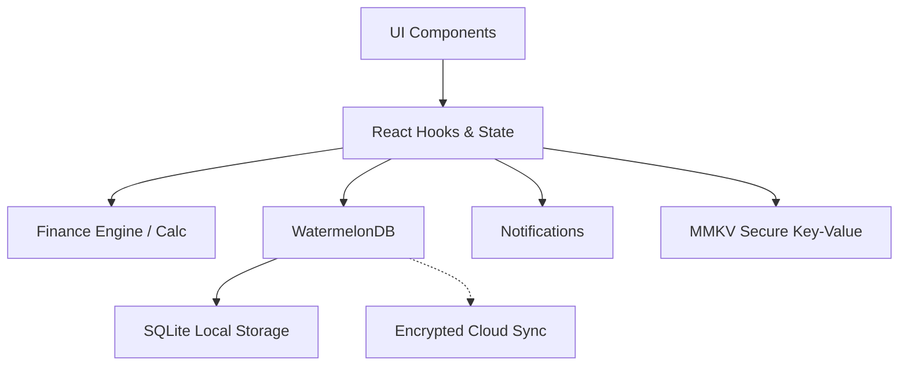

# 🍯 Money-Honey


> **Personal Financial Management — Local-First, Encrypted, Beautiful**

Money-Honey is a completely local, offline-first personal financial management application designed with top-tier security and privacy in mind. Built with React Native and Expo, it delivers a smooth native experience for tracking your accounts, managing loans, planning budgets, and forecasting investments—all without ever exposing your sensitive data to third-party servers.

## ✨ Features

| Feature | Description |
|---|---|
| 🏦 Multi-Bank | Manage multiple bank accounts in one centralized dashboard. |
| 💳 Loans & EMI | Track loan amortizations and calculate Equated Monthly Installments. |
| 📈 FDR | Fixed Deposit Receipt tracking and maturity forecasting. |
| 📜 Sanchaypatra | Manage government savings certificates and calculate coupon yields. |
| 📊 Budget | Set monthly budgets and monitor categorical spending. |
| 📱 Dashboard | A beautiful, customizable overview of your financial health. |
| ☁️ Cloud Sync | Encrypted peer-to-peer or Google Drive sync. |
| ✉️ SMS Detection | Auto-categorize spending from banking SMS notifications (Android only). |

## 📱 Download & Install

### Android APK (Direct Install)
> Latest release from GitHub Releases

[](https://github.com/YOUR_USERNAME/money-honey/releases/latest)

Steps:
1. Download the APK from Releases
2. Enable "Install from unknown sources" in Android settings
3. Install and launch

### Progressive Web App (PWA)
Visit the live web app: **[money-honey.github.io/money-honey](https://money-honey.github.io/money-honey)**
On mobile Chrome: tap ⋮ → "Add to Home Screen"

## 🏗 Tech Stack

| Technology | Purpose |
|---|---|
| React Native | Cross-platform UI framework |
| Expo | Development toolkit and build pipeline |
| WatermelonDB | High-performance reactive local database |
| MMKV | Ultra-fast key-value storage |
| AES-256 | Military-grade local encryption |
| Victory Native | Beautiful, interactive charts |
| Google Drive Sync | Secure backup and restore |

## 🔒 Privacy & Security
- 100% local-first: all data stays on your device
- AES-256 encrypted local storage
- Cloud backup is encrypted before upload — we never see your data
- No user accounts required, no telemetry

## 💻 Development Setup

```bash
git clone https://github.com/YOUR_USERNAME/money-honey.git
cd money-honey
npm install --legacy-peer-deps
npx expo start
```

### Build APK
```bash
npm install -g eas-cli
eas login
eas build --platform android --profile preview
```

### Deploy Web (PWA)
```bash
npx expo export --platform web
# Then push web-build/ to gh-pages branch
```

## 📐 Architecture


## 🧮 Financial Formulas

**Equated Monthly Installment (EMI)**
$$ EMI = P \times \frac{r(1+r)^n}{(1+r)^n - 1} $$
Where $P$ is principal, $r$ is monthly interest rate, and $n$ is tenure in months.

**FDR Net Return**
Calculates compound interest with applicable tax deductions on the accrued interest.

**Sanchaypatra Coupon Formula**
Calculates the exact payout dates and amounts based on specific certificate rules and source tax rates.

## 🗺 Roadmap
- [x] Core banking ledger
- [x] Sanchaypatra and FDR tracking
- [x] AES-256 Encryption integration
- [ ] Dark mode toggle
- [ ] PDF export
- [ ] Multi-currency support
- [ ] iOS TestFlight Release

## 📄 License
MIT License

## 🙏 Contributing
Pull requests are welcome. For major changes, please open an issue first to discuss what you would like to change. Please ensure to update tests as appropriate.
